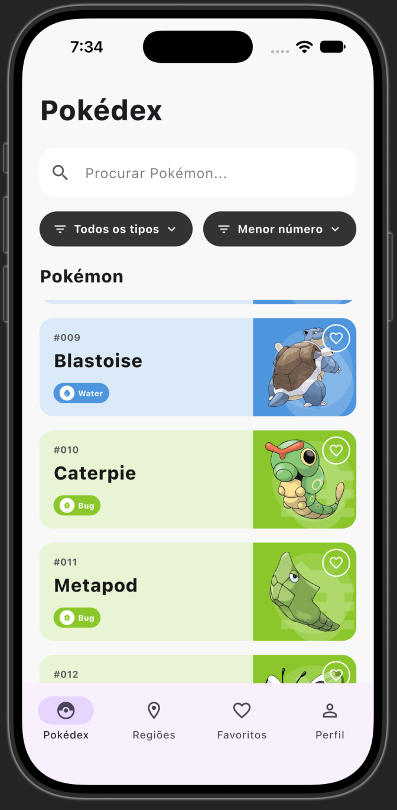
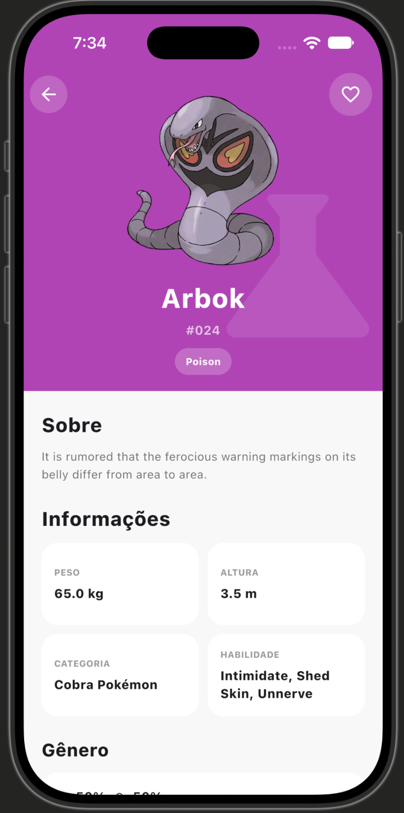
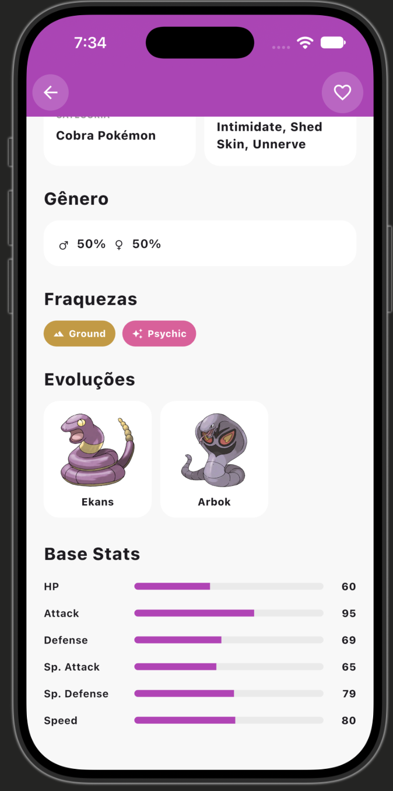
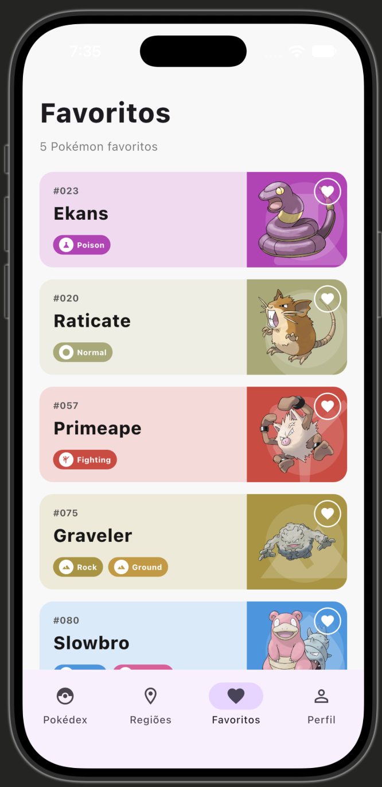
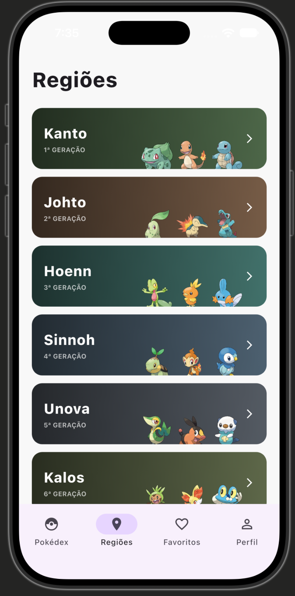

✨ Pokédex — Catch. Explore. Favorite. ✨

A Flutter Pokédex built from the Figma Community design, powered by live PokéAPI data.

  
  
  
  
  

  <b>Search • Filter • Sort • Paginate • Inspect • Favorite • Persist</b>

🎯 What is this?

This project is a Flutter implementation of the Pokédex / Pokémon App Figma reference supplied for the take-home assignment.

The app uses live Pokémon data from PokéAPI and focuses on the core requirements of the task: a polished list experience, real Pokémon details, and — most importantly — favorites that stay synchronized across the entire app.

The idea: the UI feels like a Pokédex, but the data and favorite state are real.

The assignment explicitly evaluates Flutter/Dart fundamentals, API integration, state management, design fidelity, readability, and the real-time favorites checkpoint. This implementation is built around those priorities.

👀 App Showcase

🧭 Pokédex — the home base

Search Pokémon by name, filter by type, change sorting, scroll infinitely through live API data, and favorite anything with one tap.

🔎 Pokémon Details — go deeper

The detail experience includes the Pokémon hero section, description, physical information, category, abilities, gender, weaknesses, evolutions, and base stats.

Hero + information

Gender + weaknesses + evolutions + stats

❤️ Favorites — one source of truth

Favorite a Pokémon from the list or the detail screen and the state stays synchronized. Favorites are stored locally, so they survive an app restart.

🌍 Regions — extending the Figma experience

The assignment's core requirement is the Pokédex/detail/favorites flow, but the Figma also presents region navigation. A lightweight Regions tab was added to make the navigation feel complete without introducing unnecessary backend complexity.

⚡ Core Features

Area

Implementation

Pokémon list

Live data from PokéAPI

Pagination

Infinite scroll using the API next URL

Search

Filters the currently loaded Pokémon by name

Type filter

Filters loaded Pokémon by type

Sorting

Lowest Number, Highest Number, A–Z, Z–A

Detail

Full Pokémon detail fetched by ID

Types

Type-colored chips and themed artwork panels

Stats

HP, Attack, Defense, Sp. Attack, Sp. Defense, Speed

Favorites

Add/remove from list, detail, and Favorites

Persistence

Favorite Pokémon IDs saved locally

Shared state

Riverpod single source of truth

Extra navigation

Regions + Profile tabs inspired by the supplied Figma

❤️ The Technical Checkpoint

The most important part of the assignment is not the heart icon.

It is the state behind the heart.

The app deliberately uses one shared favorites state:

                    ┌─────────────────────┐
                    │  favoritesProvider  │
                    │   Set<int> of IDs   │
                    └──────────┬──────────┘
                               │
              ┌────────────────┼────────────────┐
              │                │                │
              ▼                ▼                ▼
         Pokédex List       Detail           Favorites
              │                │                │
              └────────────────┼────────────────┘
                               │
                               ▼
                       SharedPreferences
                         local persistence

That means:

List ❤️
   ↓
Shared provider
   ↓
Detail ❤️ updates instantly
   ↓
Favorites updates instantly
   ↓
Restart app
   ↓
Favorite IDs restored

No duplicated favorite state per screen. No manual refresh. No backend.

🧠 Why These Technical Choices?

State Management — Riverpod

Riverpod was chosen because the assignment specifically asks for a single source of truth shared across screens.

The favorites state is exposed through one provider and observed by the Pokédex cards, detail screen, and Favorites screen.

That keeps the UI reactive while avoiding screen-specific copies of the same state.

Why not local setState for favorites?

setState is perfectly useful for screen-local state such as:

search text

selected type

selected sorting mode

loading indicators

But favorites cross screen boundaries, so keeping them in each screen would make synchronization fragile.

Local Storage — SharedPreferences

Only favorite Pokémon IDs are persisted.

Why IDs?

Small and simple.

Stable identifier for PokéAPI resources.

Avoids duplicating large Pokémon objects in local storage.

Detail information can be requested from PokéAPI when needed.

This matches the assignment's local-only favorites requirement without introducing a backend or cloud-sync layer.

🌐 API Integration

The app consumes the public PokéAPI.

List

GET https://pokeapi.co/api/v2/pokemon?limit=20&offset=0

The response's next URL drives infinite scrolling.

Detail

GET https://pokeapi.co/api/v2/pokemon/{id}

Additional detail data

For the richer Figma-style detail page, the app also uses related PokéAPI resources for:

Pokemon Species
Type relationships
Evolution chain

No authentication is required.

🏗️ Project Structure

lib/
├── main.dart
│
├── models/
│   ├── pokemon.dart
│   ├── pokemon_detail.dart
│   └── pokemon_page.dart
│
├── providers/
│   └── favorites_provider.dart
│
├── screens/
│   ├── home_screen.dart
│   └── pokemon_detail_screen.dart
│
├── services/
│   └── pokemon_api.dart
│
└── widgets/
    └── pokemon_card.dart

The separation keeps responsibilities understandable:

API / parsing
     ↓
Models
     ↓
State
     ↓
Screens
     ↓
Reusable widgets

🚀 Run Locally

Prerequisites

Install:

Flutter SDK

Dart SDK (included with Flutter)

Xcode for iOS development

Check your environment with:

flutter doctor

1. Clone

git clone <YOUR_REPOSITORY_URL>
cd pokedex_app

2. Install dependencies

flutter pub get

3. Run

For a connected device:

flutter run

For a specific iOS simulator:

flutter devices
flutter run -d <device-id>

The app is designed for a standard portrait phone layout.

✅ Quality Checks

Before submitting:

dart format lib/
flutter analyze

The final project should report:

No issues found!

🧩 Edge Cases Covered

The assignment asks for basic resilience, so the app handles:

Initial loading state

API/network failure with retry

Empty search results

Empty Favorites state

Favorites restored after restart

Favorite Pokémon that are not currently in the loaded list

Pagination loading state

API detail loading failures

🎨 Design Notes

The goal was reasonable Figma fidelity, not pixel-perfect duplication.

The implementation preserves the main visual language of the reference:

Rounded cards

Type-based color themes

Light tinted card backgrounds

Saturated artwork panels

Type chips

Large Pokémon artwork

Heart actions

Compact filter/sort pills

Four-item bottom navigation

Detail hero + information cards

Base-stat bars

The extra Regions and Profile navigation tabs were added because they appear in the supplied Figma. They are intentionally lightweight because they are not part of the assignment's core functional scope.

🚫 Deliberate Scope Decisions

No Login / Authentication

The supplied Figma includes login-related screens, but authentication is explicitly out of scope for this assignment.

Favorites are intentionally local-only.

No backend
No auth
No cloud sync

That keeps the implementation focused on the requirements that are actually being evaluated.

No Full Offline Cache

Full Pokémon-data offline caching was not implemented because it is optional in the assignment. Favorite IDs are persisted locally as required.

No CI/CD or Release Packaging

The assignment explicitly excludes CI/CD, release packaging, and test-coverage targets from the required scope.

🔧 Known Limitations / What I Would Improve Next

With more time, I would:

Extract shared theme/type-color definitions into a dedicated theme utility so type colors are defined once rather than in multiple UI files.

Introduce stronger API/data-layer abstractions for caching and request deduplication.

Add automated widget/unit tests around favorites synchronization and API parsing.

Turn Regions into a richer data-driven feature rather than a lightweight visual navigation screen.

Further tune spacing and typography for pixel-level Figma fidelity.

📋 Requirement Coverage

Assignment requirement

Status

Live PokéAPI data

✅

Paginated Pokémon list

✅

Infinite scroll / next

✅

Search loaded Pokémon by name

✅

Loading state

✅

Retry/error state

✅

Favorite toggle on cards

✅

Full Pokémon detail

✅

Type-colored detail chips

✅

Height / weight / abilities

✅

Base stats

✅

Favorite toggle on detail

✅

Local favorite persistence

✅

Real-time List ↔ Detail sync

✅

Real-time Favorites sync

✅

Single shared source of truth

✅

Favorites tab

✅

Empty favorites state

✅

Empty search state

✅

Portrait phone layout

✅

Clear code organization

✅

dart format

✅

flutter analyze

✅

README

✅

📝 Assignment Reference

Built against the Take-Home Assignment: Pokédex Flutter App requirements:

Flutter/Dart application

PokéAPI live data

Figma-inspired UI

List → Detail → Favorites flow

Local-only favorites

Real-time shared favorite state

Clean structure and readable Dart

README with technical choices and limitations

🎨 Design Attribution

UI implementation references:

Pokédex / Pokémon App — Figma Community
by Junior Saraiva
Licensed under CC BY 4.0, as stated in the assignment materials.

Data:

PokéAPI — public Pokémon API, no authentication required.

This repository contains an independent Flutter implementation for the take-home assignment and is not an official Pokémon product.

⚡ Built with Flutter. Powered by PokéAPI. Held together by one favoritesProvider. ❤️

Catch something. Explore something. Favorite something.

